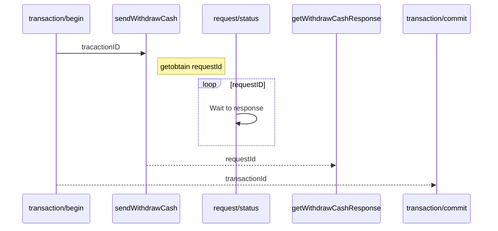

# Bankomat Demo

Dva hlavní úkoly tohoto úkolu:

 1. návrh transakčního API pomoci REST API
 2. událostně řízené UI frontendu

Ostatní záležitosti jen lehce načrtnu pro účely prototypu.

# Skutečnost vs. demo
## Bankomat
Zařízení, které zprostředkováná komunikaci a definuje rozhranní pro bankomatové aplikace. Skrze API ovládá hardware a zprostředkovává přístup k hw bankomatovým aplikacím.

S bankomatovými aplikacemi komunikuje událostně a bez omezení.

Má grafické rozhranní s pevně danným rozlišením.

Ovládání je pouze "touch", v demu nahrazeno "mouse" událostmi (onclick). 
> Pro zjednodušení se používají komponenty pro jednotlivé aplikace a pouze registrované handlery (signály neřešíme). Dále chybí sytémová mezivrstva zajišťující základní funkce bankomatu. Stejně tak neblokuji další způsoby ovládání a nedefinuji klávesnicová ovládání - to je vše nad rámec dema, prostě se jen používá událost vstupu onclick.

## Bankomatová aplikace
Aplikace běžící nad rozhranním bankomatu a je nahraná v zařízení. Má přímý grafický výstup a lze použít "touch" vstup. Využívá rozhranní bankomatového zařízení a komunikační vrstvy bez omezení. 

> Neřešíme oprávnění a systémové omezení. Pro zjednodušení je každá funkce samostatná aplikace.

## Platební karta
Pro účely dema se jedná o jakékoliv zařízení, které je schopen bankomat identifikovat, komunikovat s ním, a obsahuje EMC čip či alternativu. Neobsahuje žádné aplikace, umí ověřovat PIN a obsahuje jen jeden denní limit s dekrementací (tj. denní limit se při výdeji peněz odečítá - pozor, i když nedojde k odběru peněz!)

Pro zjednodušení každá karta obsahuje "tajný" identifikátor paycardID, identifikátor vydavatelské banky, automaticky dekrementovaný limit, platnost a aplikaci pro ověření PINu.

Simuluje se pomocí LocalStorage.

## Komunikace
 - Komunikaci s komunikační farmou provozovatele bankomatové sítě zajišťuje aplikační jádro bankomatu. Toto se konfuguruje skrze systémové menu a po odemčení přístupu. Tento komununikační kanál je obousměrný a řídí jej samostatně jádro bankomatu, stejně tak zajišťuje obnovení komunikace a řeší případnou nedostupnost sítě.
 - Bankomat obsahuje generátor one-time tokenů, systém přesného času, generátor náhodných čísel a obvykle hw kryptovací zařízení. Tím jádro zařídí bezpečnou komunikaci a bankomatová aplikace toto neřeší.
 - Bankomatová aplikace předává jádru svůj požadavek na komunikaci s API (datový objekt či XML fragment) a jádro zajistí zabalení požadavku, zašifrování obsahu, a přenos požadavku skrz zabezpečený komunikační kanál do farmy provozovatele bankomatové sítě. Bankomatová aplikace dostane jako odpověď RequestID, a čeká na odpověď z API, která bude toto RequestID obsahovat.
 - Bankomatová síť může požadavek odbavit sama, popř. předává požadavek dále k vyřešení do sítě vydavatele karty, provozovatele platební brány, provozovatele aplikací či přímo do sítě banky.
 - Bankomatová síť také může sama zasílat požadavky na vyřízení v zařízení bankomatu, typicky např. zašle požadavek na aktualizaci PIN v čipu EMV, který si uživatel karty změnil jinou cestou (např. v online bankovnictví)
 
 V demu se místo tohoto postupu použivám REST (je to tak v zadání). REST požadavky tedy musí být transakční a asynchronní. 
 Každý požadavek musí obsahovat platné *transactionID*, které se vydává službou **transaction/begin** a následně ukončuje službou **transaction/commit** respektive **transaction/rollback**. 

> Automatické ukončování po určitém uplynulém čase, popř. navazování na otevřeneé transakce či logika křížových transakcí je nad rámec tohoto dema.

 Odpovědí na každý požadavek je *requestID*. Následně se čeká na vyřízení požadavku sledováním služby **request/status**, dokud není nalezena odpověď pro tento request. 

>  V demu jde jen o ukázku návrhu asynchronního API a tak není 
paralerizace a asynchronnost implementována. V plném řešení bych toto implementoval jako službu, kterou frontend bude sledoval pomocí techniky long pollingu a v jednom kanále by se zasílaly všechny odpovědi a události z backendu (ideálně z nějakého event streaming systému).

 Po zjistění existence odpovědi se tato odpověď přečte z její get služby.

Bezpečnost komunikace v rámci demo aplikace je řešeno jen pomocí simulace přidání tokenu bankomatu, "tajného" paycardID použité karty a zašifrování obsahu. Berte to jen jako ukázku, že se něco takového nějak řeší.

 
## Aplikace výběru hotovosti
 
V případě výběru pěnez může být několik scénářů:
	 - offline - ověření pomocí EMV čipu na kartě (kontroluje limit a inkrementuje tyto limity a ověřuje PIN)
	 - online credit - ověřeni zajišťuje vydavatel karty, PIN ověřuje jak čip EMV v kartě nebo lze ověřovat online
	 - online bank - ověření zajišťuje přímo banka včetně kontroly PIN

V rámci dema implementuji tyto dva scénáře:
 1. Offline - ověřuje se limit a pin v čipu karty (toto by stačilo, ale nevyužije se pak navržené API). Pro karty vydané jinou bankou než ACME Corporation.
 3. Online - ověřuje se limit a pin online. Pro karty vydané bankou ACME Corporation.
 Pro simulaci čipů v kartách se používá LocalStorage. Každá karta má svůj "tajný" identfikátor paycardID, limit, pocitadlo, typ, id vydavatele, pin a platnost.

Další důleživá součást aplikace je komunikace s bankomatovým jádrem, zda je možné danou částku vydat (tj. zda je dostatek bankovek v bankomatu). Např. zda má dost hotovosti na vydání částky 124.000,- popř. zda má bankovky nejmenší hodnoty 500,- a lze-li tak ídnout výběr této částky, či zda je schopen požadovanou částku v rámci kombinace uložených bankovek vydat. Toto není v demu detailně rozpracováno - byť by to byl zajímavý programátorský úkol, jen simulováno v rámci prototypu - vždy odpovídá: *true* :-)

